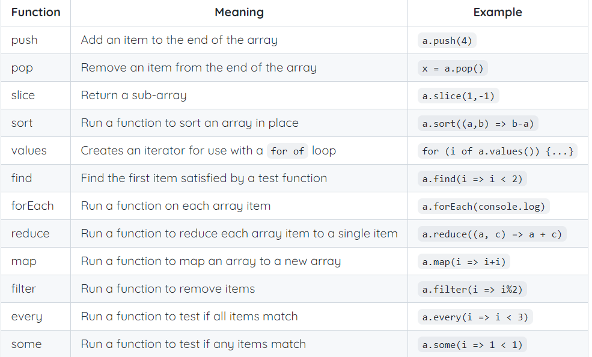

## Using Git/GitHub in VS Code
_ 
**
    (Using terminal and browser. Explore better ways in future) 
    
    1. **Pull** from GitHub ->_git pull_  
    2. **Edit** code                          *  
    3. **Save**                               *  
    4. **Add** and **commit** changes         *  
        -> _git add ._  
        ->_git commit_ _-m_ _"MESSAGEHERE"_  
    5. **Push**  
        -> _git push_  
    Steps with * should be done very regularly  
    
## Formatting Tips  
For Newline, leave 2 spaces, then hit enter  
>>>>>>> 11b5a252e4a675fba901dcaa2ca07d02653e6ecb
Helps if you put _ and ** up top on their own line
    See the GIt/GitHub in VS Code notes as reference

## DNS Records
    Used this so that my domain name actually sends people to my server, kolo? 
    They are files that live in DNS servers  
    Needed so a user can access webiste using the domain name  
    Domain Naming System --> the global system that maps human-readable hostnames to the IP address  
    Contain useful info to help find a the IP address you're looking for  
    A - address - shows IP address for specific hostname  
    CNAME - points to a domain name, an alias  
    

## Deploying
Has to be in linux  
Use the key file in linux, the windows permissions won't work. It's in ~/byu/keys  

## Responsive Design

    header { flex: 0;} 
    // makes the header a fixed size, the minimum size to display the content. Displayed as block 
    h1 {
  display: inline;
  float: left;
  padding-right: 20px;}
  // puts the h1s on the same line, floated to left of the parent, with 20px between them all 

## Javascript  
    Inspired by Scheme, Interpreted, Dynamically typed  
    How can I use the browser debugging console  
    Print out to terminal: console.log('string') 
    Use a script tag in head to reference the script  
    Or can write it into the html  
    f12 for debugger in browser  
    - Use window.localstorage to make a cache to fallback on  

    
## Debugging in JS  
    Can open the degugger in browser. Don't guess. Use your tools  
    You want to debug to your last stable state, see exactly where things first go wrong.  
    State what your assumptions are.  
    Verify that your assumptions are true.  

### JS

## JS Loops  
For in -- goes over property names  
For of -- goes over property values

## JS Arrow Functions
JS version of lambda function  
(parameters) => return value;  
See more: https://learn.cs260.click/page/javascript/arrow/arrow_md  

## JS Arrays  
Use []  
  
push, pop, slice, sort(func), values (creates it to use iwht for of loop)

## JSON  
Way to represent data so it is easily convertible to JS object  
https://learn.cs260.click/page/javascript/json/json_md  
"string", 42, true, ["array", 42], {"object":1, "A":2}, null  

## JS Objects  
https://learn.cs260.click/page/javascript/objectClasses/objectClasses_md 
JS's version of maps in CPP  
Useful functions:  
Object.entries(obj_name) - returns array of key value pairs  
Object.keys(obj_name) - returns array of keys  
Object.values(obj_name) - returns array of values  
'this.' pointer used to reference an object's property (attribute). Like python's 'self.'  
# Constructor  
Any function tha returns an object  
Invoke with 'new' operator  
# JS Regex  
https://learn.cs260.click/page/javascript/regularExpressions/regularExpressions_md  
'i' means case insensitve.  
# Rest  
How you let a function take unknown number of parameters  
rest will create an array with remaining parameters  
...name_of_array  
# Spread  
Opposite of rest. Unpacks an array into parameters  
function(...[array goes here]);  
# Destructuring  
https://learn.cs260.click/page/javascript/destructuring/destructuring_md  
Pulling stuff out of arrays or objects  
const [b, c] = array_of_nums  
Pulls first two elements from nums into b and c  
# Scope in JS  
Arrow functions refer to the active scope when they were created, the parent scope, you could say?  
## JS Modules  
https://learn.cs260.click/page/javascript/modules/modules_md  
Need to explicitly export objects from one file  
Then you can: import {...} from '...';  
Can only call modules from other modules  
## DOM  
https://learn.cs260.click/page/javascript/dom/dom_md
Object representation of HTML elements  
The browser lets external code manipulate HTML via the "document" global variable, points to the root element  
Useful functions include querySelctorAll, createElement, appendChild, removeChild to add new elements  
You can attach an event listener function to any DOM element. It is called when that event happens.  

### Web Service  
## Noe.js
"You can never understand everything, but you should push yourself ot understand the system." - Ryan Dahl  
Chrome has a JS interpreter in it  
Node.js lets you run JS without a browser, lets you see how the chrome V8 engine would handle it, kinda like chrome debugger console/terninal  
Can use Node.js as a debugger in VS code
Node - the interpreter, program that runs the JS  
NVM - Node version manager - lets you upgrade version real easy  - need to install separately with windows-nvm program - not super necessary. 
NPM - Node Package Manager - PIP for JS, import other people's packages.  
How to use?   
- npm init -y // runs default commands
- npm run start // lets you run the code.
You don't want to commit all the source code. Keep it local. gitignore
Can use open source, Node.js, common js to get a 3rd party server

## We gonna write our server with Node.js  
We will write an https servece that listens on a port and returns the HTML and renders it  
require ('http') uses built in package  
You can then use its functions  
Tell it what port to listen on. What's with port numbers?  
localhost:port_number to see your service.  

- What we write here will take a request and return our html, css, js. Caddy is just a router for different ports, takes simon. and sends it to the right port. 

### Service Design  
- Visualize the design.
- What are my endpoints? (functions you can call on backend)
- For Simon
- Create account, login, logout
- Get user, Get scores, Get scores
Use the HTTP verbs in express - get, put, post, delete

### Websocket  
HTTP - great at making client-server requests  
But not at sending messages between clients or sending notifications - it has to wait for a request - not efficient at all
For that, we use Websocket
- It piggy-bakcs on HTTP - client sends HTTP request to change connection protocol to websocket
- Server sends back if protocol succesfully switched. Brilliant idea, use what you got and build on it
- npm install ws -- wraps it, makes it easier
- I will probably need a pingpong setup - see simon
